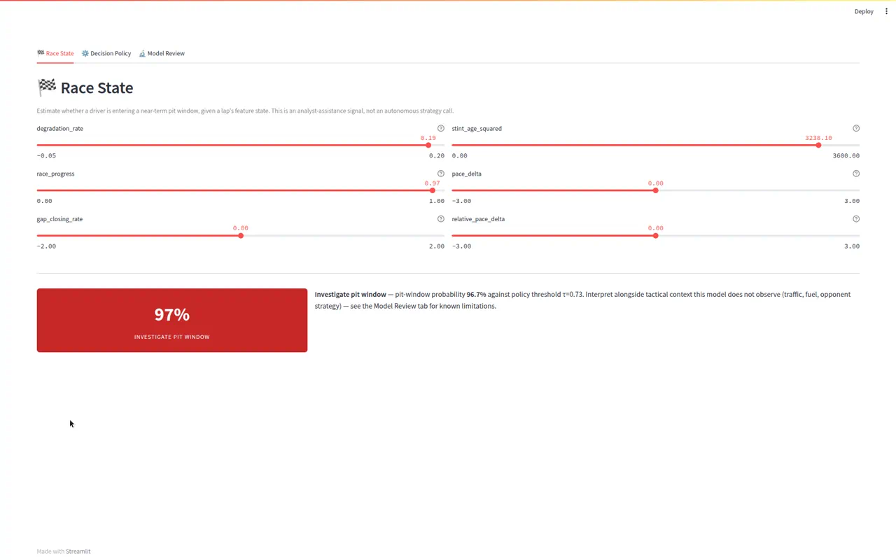
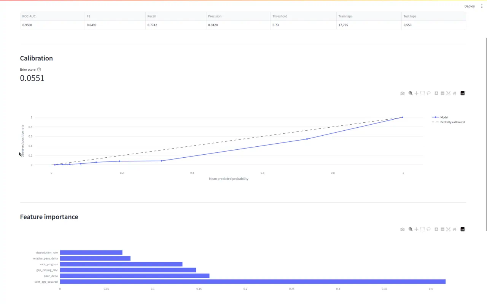

# 🏎️ F1 Pit-Window Decision Support 🏁

> A reproducible machine-learning system that estimates whether a Formula 1
> driver is likely to **pit within the next 5 laps**, from historical
> [FastF1](https://github.com/theOehrly/Fast-F1) race-session data.

[](https://www.python.org/)
[](#-development)
[](#-development)
[](https://streamlit.io/)
[](LICENSE)

This is a **decision-support prototype**, not an autonomous race-strategy
optimizer. The dashboard surfaces uncertainty, threshold tradeoffs, and the
tactical context the model does *not* observe — read
[`docs/limitations.md`](docs/limitations.md) before quoting a metric from this
project anywhere.

> **Current state:** the pipeline is implemented, linted, and tested (142 tests,
> ~93% coverage on business logic). One real run has been produced end to end
> against real FastF1 data (3 ingested 2024 races — Monaco, Italian GP,
> Singapore), held out at the race level (train on Monaco + Italian GP, test
> on Singapore): **ROC-AUC 0.960, F1 0.886** on that held-out race. This is
> **not** the cross-season protocol [ADR 002](docs/decisions/002-temporal-validation.md)
> describes (train 2018-2023, test 2024) — this environment's egress policy
> blocks fetching earlier seasons from FastF1, so only one season's races were
> available to split. `scripts/train_model_race_holdout.py` documents the
> substitution and `models/metrics.pkl` carries an explicit `protocol` field
> so the number can't be mistaken for the documented result. Re-running the
> real cross-season protocol once more history is ingested is the natural
> next step; see the Quick start below.



---

## ✨ What it demonstrates

- **⏱️ Time-aware validation** — train on earlier seasons, evaluate once on a
  fully held-out later season, never a random shuffle-split
  ([ADR 002](docs/decisions/002-temporal-validation.md)).
- **📐 A canonical, versioned feature registry** — governed metrics
  (`gap_to_leader`, `tyre_age`, `pit_delta`, `degradation_rate`,
  `stint_age_squared`, `race_progress`, `pace_delta`, plus two strategy-context
  features), each with a pandas implementation and — where applicable — a SQL
  implementation tested against it, replacing four independent, undocumented
  reimplementations of the same metric from this project's history
  ([ADR 004](docs/decisions/004-canonical-metric-schema.md)).
- **🛡️ Pre-serving validation gates** — a batch of laps or a set of model
  artifacts is checked (completeness, consistency, physical plausibility;
  NaN/Inf, out-of-range probabilities, impossible saved metrics) before it
  reaches the dashboard. A failing batch is rejected with an audit trail; the
  last known-good snapshot keeps serving.
- **🎯 Calibration and group-wise evaluation** — not just an aggregate ROC-AUC.
  Brier score, a reliability curve, and metrics sliced by circuit or season,
  because one number across a whole held-out season hides exactly the failure a
  reviewer will ask about.
- **📓 An honest engineering record** — [`docs/decisions/`](docs/decisions/)
  documents real bugs this project's own tests caught during development (a
  same-row timestamp subtraction that was always null, a validation check that
  flagged every pit stop as invalid, a feature whose first draft measured the
  wrong thing), not just the corrected final state.
- **🧭 A decision-workflow dashboard, not a tab bar** — three views organized
  around what an analyst actually needs to do, not five loosely-related charts.
- **📈 Instrumented, git-correlated pipeline benchmarking** — `make benchmark`
  times the load/feature-build/train stages against real data and appends
  runtime and row-throughput to
  [`metrics/benchmark_results.csv`](metrics/benchmark_results.csv), tagged with
  the commit that produced each run — a real, growing performance record, not
  a one-time claim in this README.
- **🔁 Scheduled data refresh and retraining** — a cron-triggered workflow
  (`.github/workflows/scheduled-retrain.yml`, ~every 4 months) re-ingests new
  F1 seasons, retrains, and gates the result through the same model-artifact
  validation the dashboard uses before publishing anything — a bad run stops
  the pipeline, it never gets silently promoted.

## 📊 The dashboard

| Race State | Model Review |
|:---:|:---:|
|  |  |
| Feature state → pit-window probability, phrased as *"investigate,"* not *"pit now."* | Held-out metrics, calibration reliability curve, and feature importance. |

- **🏁 Race State** — current feature state → pit-window probability, framed as a
  decision-support signal rather than a command.
- **⚙️ Decision Policy** — the threshold / precision-recall tradeoff as an
  explicit, named policy choice, not a bare slider.
- **🔬 Model Review** — calibration, feature importance, and this project's own
  stated limitations, surfaced in the app itself.

## 🧱 Architecture

```
raw FastF1 laps
      │
      ▼
ingestion/fastf1_client.py   (fetch only — no normalization)
      │
      ▼
data/cleaning.py             (normalize + bounded sensor-gap imputation)
      │
      ▼
data/validation.py           (completeness / consistency / reasonableness)
      │
      ▼
data/repository.py           (publish-if-valid; else serve last known-good)
      │
      ▼
features/build_features.py   (versioned, SQL-tested metric registry)
      │
      ▼
modeling/train.py            (temporal split → LR/RF/XGBoost CV → threshold tuning)
      │
      ▼
modeling/{calibration,evaluate,inference}.py
      │
      ▼
app/streamlit_app.py         (Race State / Decision Policy / Model Review)
```

`monitoring/drift.py` (Population Stability Index) exists alongside this
pipeline but isn't wired to a live feed yet — see
[`docs/limitations.md`](docs/limitations.md).

This is a **single-process monolith**, deliberately — one Python package,
one Docker image, every arrow above is an in-process function call, not a
network hop between separately-deployed services. See
[`docs/decisions/007-monolith-architecture.md`](docs/decisions/007-monolith-architecture.md)
for the options analysis behind that choice.

## 🚀 Quick start

**Requirements:** Python 3.11+, PostgreSQL (or Docker), and network access to
the FastF1 data API for the first ingest.

### 1. Clone and create a virtual environment

```bash
git clone https://github.com/A-Kuo/Formula-1-Data-Strategy-System.git
cd Formula-1-Data-Strategy-System
```

<details>
<summary><strong>macOS / Linux</strong></summary>

```bash
python3.11 -m venv .venv
source .venv/bin/activate
```
</details>

<details>
<summary><strong>Windows (PowerShell)</strong></summary>

```powershell
py -3.11 -m venv .venv
.\.venv\Scripts\Activate.ps1
```
</details>

### 2. Install dependencies

```bash
pip install -r requirements.txt
```

### 3. Start Postgres, ingest, train, and launch

```bash
make db-up                 # start a local Postgres via docker-compose
                           # (or point DATABASE_URL at your own instance)
make ingest                # fetch + clean FastF1 laps into Postgres
make apply-view            # apply the canonical metrics SQL view
make train                 # temporal split → CV → threshold tuning → artifacts
make app                   # launch the dashboard at http://localhost:8501
```

> **First-run note:** the initial ingest downloads and caches race telemetry
> into `.cache/`, so it is slow the first time and fast on every run after.
> `make apply-view` creates the `canonical_lap_metrics` view, which depends on
> the `laps` table — to re-ingest from scratch, drop the view first
> (`DROP VIEW IF EXISTS canonical_lap_metrics CASCADE;`).

Prefer containers for everything? `make docker-up` runs the full stack
(Postgres + Streamlit) via `docker-compose`.

## 🛠️ Development

```bash
make test        # full pytest suite, coverage-gated at 85%
make lint        # flake8 over src/, tests/, and scripts/
make gate        # lint + SQL-drift check + tests — the CI gate, locally
make view        # regenerate db/metrics_view.sql after a feature-registry change
make benchmark   # time load/feature-build/train, append to metrics/benchmark_results.csv
```

The suite is **142 tests** (141 run without a database; one live-Postgres
parity check runs when `DATABASE_URL` starts with `postgresql://`) at ~92%
coverage on business logic. See [`AGENTS.md`](AGENTS.md) for environment notes.

## 🗂️ Project structure

```
.
├── src/f1_pit_window/
│   ├── ingestion/fastf1_client.py   # fetch-only FastF1 client
│   ├── data/                        # contracts, cleaning, validation, repository, schema
│   ├── features/build_features.py   # canonical, SQL-tested metric registry
│   ├── modeling/                    # train, calibration, evaluate, inference
│   ├── monitoring/                  # drift (PSI, not yet live-wired) + pipeline benchmarking
│   └── app/streamlit_app.py         # the three-view dashboard
├── scripts/                         # ingest, train, benchmark, validate, generate/apply the SQL view
├── metrics/benchmark_results.csv    # git-tracked pipeline runtime/throughput history
├── tests/                           # 142 tests (pandas ↔ SQL parity, gates, modeling)
├── db/metrics_view.sql              # generated from the feature registry
├── docs/                            # methodology, data-quality, ADRs, limitations
├── docker-compose.yml               # Postgres + Streamlit
└── Makefile                         # every workflow command above
```

## 📚 Documentation

| Doc | Covers |
|---|---|
| [`docs/methodology.md`](docs/methodology.md) | Problem framing, temporal validation, target definition, model comparison |
| [`docs/data-quality.md`](docs/data-quality.md) | Exclusion criteria, retention, the validation gate |
| [`docs/feature-engineering.md`](docs/feature-engineering.md) | The governed features, and what's deliberately not implemented |
| [`docs/model-evaluation.md`](docs/model-evaluation.md) | Metrics, calibration, group-wise evaluation, the metrics-discrepancy resolution |
| [`docs/limitations.md`](docs/limitations.md) | Scope, data-scope, and validation-scope limitations, stated up front |
| [`docs/decisions/`](docs/decisions/) | ADR-style records of design decisions and the bugs building them caught |
| [`MIGRATION_MAP.md`](MIGRATION_MAP.md) | What moved, got rewritten, or got dropped from the prior iteration, and why |

## ⚠️ Scope & limitations

This model estimates *near-term pit-window likelihood* from tire degradation and
race state. It does **not** jointly optimize tire choice, fuel, traffic, or
competitor response, and it is trained on clean, dry-race laps only. Its
behavior under safety-car, VSC, standing-start, and wet conditions is
unvalidated. Read [`docs/limitations.md`](docs/limitations.md) in full before
citing any number from this project.

## 📝 License

MIT License — see [`LICENSE`](LICENSE).

## 🙏 Disclaimer

No copyright infringement intended. Formula 1 and related marks are the property
of their respective owners. All data is sourced from publicly available APIs via
[FastF1](https://github.com/theOehrly/Fast-F1) and used for educational,
non-commercial purposes only.

---

<div align="center">
Built for reproducible, honestly-scoped motorsport analytics. 🏎️💨
</div>
